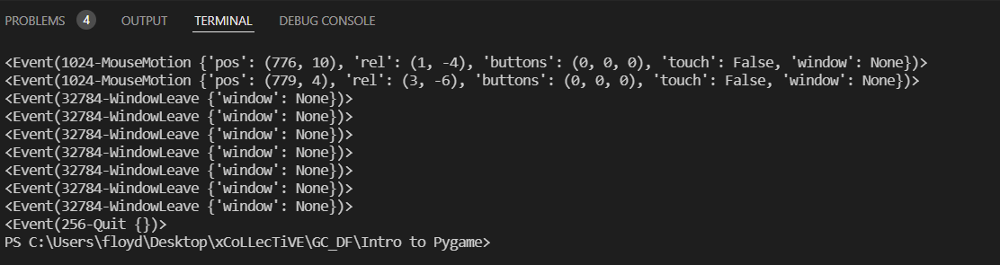

1. Start with creating screen
2. Basic game loop and quit event - demonstrate printing events to screen
3. Drawing and loading objects to the screen (rect takes  x,y, show 400, 400, then 350, 350), increase in y position, you move down. then player image
4. Making our code object-oriented, creating a Game class


# Beginning Game Design with Python

Improve your Python programming skills by creating a simple computer game! In this workshop you will be introduced to [Pygame](https://www.pygame.org/wiki/about), a free and open-source library for creating computer games in Python.  Specifically, you will create a simple “Frogger” style game that will introduce you to the following concepts:  drawing graphics to the screen, capturing keyboard input and representing movement, creating basic collision detection, increasing difficulty, and implementing game loops with win/lose conditions.  

## Requirements

By default, Pygame is not included with Python installations. For this workshop, we'll assume that you've already installed [the latest version of Python on your machine](https://www.python.org/downloads/) (or at least Python 3x). 

Next, we'll need to install Pygame via `pip` in the command line or terminal. Open up your command prompt and type the following command:

```console
pip install pygame
```
The command should automatically install the latest version of Pygame on your machine. __Note:__  If you happen to have Pygame already installed, you can upgrade to the latest version with the `--upgrade` flag:

```console
pip install pygame --upgrade
```
(If the upgrade command shows a ModuleNotFoundError, you’ll know Pygame is not currently installed.)

Please see the [official installation instructions](https://www.pygame.org/wiki/GettingStarted) if you run into any difficulties installing Pygame.

If you are curious about any of the functions or tools that we will be exploring, I highly recommend checking the [Pygame docs](https://www.pygame.org/docs/). Pygame has very thorough documentation and the docs are an invaluable resource for understanding the possibilities open to you as a game designer.

__UPDATE__: As of the time of writing this, the developers of the Pygame website have decided to temporarily shut down the site to show support/solidarity with Ukraine. Unfortunately, this means you currently can't access the documentation online. You can, however, generate the Pygame docs locally by writing the following in your terminal/command prompt:

```console
python -m pygame.docs
```

## Workshop Goals

In this workshop, you'll learn to:

1. implement and understand the Pygame library
2. utilize an object-oriented programming approach
3. draw and manipulate graphics on the screen
4. handle keyboard input
5. work with game loops and win/lose conditions

So, without further ado, let's get started!

## Initial Parameters and Set-up

The first thing we'll need to do is create our game screen, where all of the action will take place. Let's create a series of constant global variables to define the height, width, and title of the screen, along with some base colors to use:

```python
# import library
import pygame

# initialize pygame
pygame.init()

# size of our screen and caption
SCREEN_WIDTH = 800
SCREEN_HEIGHT = 800
SCREEN_TITLE = "Froggish"
# screen color in RGB
WHITE_COLOR = (255, 255, 255)
BLACK_COLOR = (0, 0, 0)
```

First we `import` the Pygame library, and initialize (`init()`) it so we can use it in our project. Next, we create our variables for the screen size (800x800, so it doesn't fill our entire computer screen but still gives us a lot of room to play with) along with giving our window a title. Next, we create two constants for a basic black and white color. In Pygame, color is determined by RGB value (e.g., 255, 255, 255 is white). Because we don’t want any of these variables to change, we make them all constants (indicated by the all-caps).

Next, we'll need to create a "clock" object that will allow us to control the framerate or FPS of the game, which is the speed at which we refresh the display. For most games, 60 FPS is the standard, so we’ll set the clock’s "tick" rate to a constant 60. We'll also want to set up a font we can use for displaying text:

```python
# clock to handle FPS
clock = pygame.time.Clock()
TICK_RATE = 60
# font set-up
pygame.font.init()
font = pygame.font.SysFont('comicsans', 75)
```

After creating our clock and setting the tick rate, we initialize our Pygame font and set it to ComicSans (or whatever you'd like) with a size of 75. We'll use this font when we want to present text to the player (such as a "game over" message). 

## Creating Our Game Class

Let's get right into creating our `Game` class, which will handle all the basic logic for running the game. First, we'll create our game screen now that we have the initial parameters we need:

```python
class Game:
    def __init__(self, image_path, title, width, height):
        self.title = title
        self.width = width
        self.height = height

        # create window of specified size
        self.game_screen = pygame.display.set_mode((width, height))
        # set the game window color to white
        self.game_screen.fill(WHITE_COLOR)
        pygame.display.set_caption(title)

        background_image = pygame.image.load(image_path)
        self.scaled_bkg = pygame.transform.scale(background_image, (width, height))
```

Let's break this code down. First, we initialize our `Game` class with a few starting parameters: `self`, `image_path`, `title`, `width`, and `height`. `self` simply allows us to utilize our variables throughout the class's methods (which we'll need to create soon). `image_path` will pass in the background image we want for our game. `title`, `width`, and `height` are the parameters we'll use to designate the size of our game screen. 

We create our game screen itself by using the `pygame.display.set_mode()` function. Our `game_screen` variable represents a Pygame _surface_, which you can think of like a canvas on which you draw graphics and text.  In the `pygame.display.set_mode()` function, we will pass an argument for the display resolution, which is our two variables representing width and height in a tuple.  Note that the tuple is contained within the function’s parentheses, so there are double parentheses in the function above.  

To give our screen a basic fill color, we use the `fill()` function, using our `WHITE_COLOR`. Next, we set our window caption with the `set_caption()` function, which will be the `title` that we pass in when we create a new `Game` object. 

Lastly, we'll `load()` in the background image we want to use for our game. This will be passed in as the parameter `image_path`. We then use the `scale()` function to resize the image so that it fits our game screen window, and set it to a new `scaled_bkg` variable.

Now that we have our basic initializer set-up for our `Game` class, let's go ahead and create a new class method that will allow us to run our game.

### The runGame() Method

Our `runGame()` method will control the main _game loop_ for our program. This means we want our game to continue running until a certain condition (game over) is met. Let's create a looping mechanism that will do just that:

```python
    def runGame(self):
        isGameOver = False

        while not isGameOver:
            for event in pygame.event.get():
                if event.type == pygame.QUIT:   # if event type is a quit event
                    isGameOver = True
            print(event)
            # update the graphics
            pygame.display.update()
            # tick our clock and render next frame
            clock.tick(TICK_RATE)
            # fill the screen background
            self.game_screen.fill(WHITE_COLOR)

        pygame.quit()
        quit()
```

First, we create a new variable for tracking our game over condition, aptly named `isGameOver`, which we initially declare as `False`. Next, we create a `while` loop that will continue to run until `isGameOver` is set to `True`.

Within the `while` loop, we use a `for` loop to cycle through `events`. (When working with `while` loops, always watch your indentation closely so you don’t accidentally create an infinite loop.)  To log user input (mouse placement, key presses, closing the window, etc.), we use the `pygame.event.get()` function.  This function creates a queue of all events and allows the program to respond accordingly. To control our game over condition, we check if the built-in `quit` event (meaning the user has closed the game screen window) has occurred.  We also print all events to the console so we can monitor the events unfolding. We also `update()` our game display and tick our `clock` each iteration of the loop.

Lastly, we set our game_screen to have a basic white fill. We then `quit` out of Pygame (_outside_ of the `while` loop).

### Running the Game

Before we can test to see if our code is working, we need to create a new `Game` object and call our `runGame()` function. So, outside of our `Game` class, write the following lines:

```python
new_game = Game('frogger_bkg.png', SCREEN_TITLE, SCREEN_WIDTH, SCREEN_HEIGHT)
new_game.runGame()
```
We first pass in our background image. There will be some additional steps we'll need to accomplish before the background actually displays in our game window, but we can at least pass in the image for now so we're prepared. We then pass in the remaining title and size parameters, and finally call our `runGame()` method.

If you run your script, you should now see an empty white screen display. If you move your mouse around, you can see all of the events being tracked in the console. If you click the <kbd>X</kbd> button to close the window, you should then see a "Quit" event being registered:



Next, let's start adding some objects to our game environment.

## Drawing Objects to the Screen

We will be using our own custom images in this game, but first let's just demonstrate on a basic level how drawing functions work in Pygame.

Let's say we wanted to draw a simple rectangle and circle to the screen. In the `while` loop, add the following lines:

```python
# demonstrates drawing
pygame.draw.rect(game_screen, BLACK_COLOR, (350, 350, 100, 100)) # surface, color, (x, y, width, height)
pygame.draw.circle(game_screen, BLACK_COLOR, (400, 300), 50)
```

To draw our rectangle, we’ll use the `draw.rect()` function. This function requires three main parameters:  the surface to draw on, the color of the rectangle, and the rectangle object (specifying the left position, the upper position, the width, and the height). The `draw.circle()` function similarly takes a surface, a color, a center position, and a radius. The current values will create a rectangle in the center of the screen, with a circle aligned on top of it.

As mentioned, we will be using our own images, so you can go ahead and __delete__ or __comment__ out these two lines of drawing code. This was meant for demonstration purposes so you can see how drawing in Pygame works more generally.

Let's begin actual development by creating a new class for our game objects.

### The GameObjects Class

Because we will be creating several different types of objects (a player object, enemies, and treasure), let's create a parent object class from which we can derive each of the other classes. This `GameObjects` class will house all of the basic attributes and functionality that each object shares in common with the others.

```python
class GameObjects:
        def __init__(self, image_path, x, y, width, height):
            self.x_pos = x
            self.y_pos = y
            self.width = width
            self.height = height

            # get each object's image and scale it
            object_image = pygame.image.load(image_path)
            self.image = pygame.transform.scale(object_image, (width, height))
            
        def draw(self, background):
            background.blit(self.image, (self.x_pos, self.y_pos))
```

Because every object will have a unique image, an x and y position, and a width and height, we first define these as attributes in our initializer. Next, we load each object's image into the `object_image` variable, and scale it to make our objects' sizes relatively uniform. Lastly, we create a new `draw()` method that will allow us to draw each object's image over our game's background. To draw images in Pygame, we use the `blit()` function, which allows us to draw an image on top of another image (a surface).

Now that we have our basic attributes set up for our game objects, we can begin to create the objects themselves. First, let's create a class for our player-character. We know we want our character to be able to move around the screen, so let's include that functionality into the class first.

### Moving Our Character

To start, we need to add a line of code to our game loop in the `runGame()` method.         

```python
while not isGameOver:
            for event in pygame.event.get():
                if event.type == pygame.QUIT:   # if event type is a quit event
                    isGameOver = True
                # detect when key is pressed
                direction = pygame.key.get_pressed()
                print(event)
```

In our `for` loop, we create a new variable, `direction`, to log which keys are being pressed on the keyboard with the `get_pressed()` function. We can use this variable to record which direction the player wants to go and move their character accordingly.

Next, we'll create a new class for our `PlayerCharacter` down below (and outside of) the `GameObjects` class we created earlier:

```python
class PlayerCharacter(GameObjects):
    SPEED = 10
    
    def __init__(self, image_path, x, y, width, height):
        super().__init__(image_path, x, y, width, height)

    def move(self, direction, max_height):
        # move player based on direction pressed
        if direction[pygame.K_UP]:
            self.y_pos -= self.SPEED
        elif direction[pygame.K_DOWN]:
            self.y_pos += self.SPEED
        elif direction[pygame.K_LEFT]:
            self.x_pos -= self.SPEED
        elif direction[pygame.K_RIGHT]:
            self.x_pos += self.SPEED
        
        # prevent player from moving below the screen (subtracting the image's height from the screen height)
        if self.y_pos >= max_height - self.height:
            self.y_pos = max_height - self.height
```

As you can see, we include the `GameObjects` class in our `PlayerCharacter` class declaration to indicate that `PlayerCharacter` is a _subclass_ of `GameObjects`.

Next, we create a new variable `SPEED`, which will allow us to control how fast the player can move their character. To be able to have access to the rest of the variables in the `GameObjects` class, we then use a technique called _inheritance_ with the `super()` function. `super()` allows us to utilize all the attributes and methods of our parent class (`GameObjects`).

To move our character around, we also create a new `move()` method specific to our player object. We take in two parameters: the `direction` variable we created above to track our player's movements, and a `max_height` parameter (which will be the maximum `y` size of our screen, 800) that we'll use to apply a boundary at the bottom of the screen.

To get which the direction the player wants to go, we use a series of `if elif` statements, along with Pygame's built-in key constants. For each press, we move the character by adding or subtracting their current position by the speed (10) we have set. 

If we were to run the game now, you'd notice you can move your character beyond the bounds of the game screen. Obviously, this is something we'd want to correct. As an example of how this can be done, we created a boundary at the bottom of the screen in the last lines of code above. This simple `if` statement checks the player's position, and using the height of the character's image, determines if they are about to cross the bottom of the screen. If they are, we reset their position so that they can't drift out of bounds.

### Spawning Our Player-Character

Now that we have some basic functionality for our player-character object, let's go ahead and add it to our game and render it to the screen. To do so, we first need to create an instance of the `PlayerCharacter` class. In the `runGame()` method, underneath the `isGameOver` variable declaration, add the following:

```python
player_character = PlayerCharacter('frog.png', 375, 700, 50, 50)
```

Here we create a new `player_character` object, using our frog image, and supplying the rest of the parameters we defined for the class (`x`, `y`, `width`, and `height`). 

Next, let's use our `draw()` and `move` methods. In the `while` loop of our `runGame()` method, add the following lines of code (below the game screen `fill` function):

```python
    player_character.move(direction, self.height)
    player_character.draw(self.game_screen)
```

Based on the direction of your key press, your character should now be able to traverse the game screen, and you should also be unable to move below the bottom boundary of the screen. As a challenge for later on, I'd encourage you to attempt the other three sides of the screen on your own!

## Enemies

Now that we have our player object ready to go, we should create some enemies for the player to contend with. Like we did with the `PlayerCharacter` class, let's create a new class for enemies, also keeping it a subclass of `GameObjects`.

```python
class EnemyCharacter(GameObjects):
    SPEED = 5
    
    def __init__(self, image_path, x, y, width, height):
        super().__init__(image_path, x, y, width, height)
        self.image_path = image_path

    def move(self, max_width):
        if self.x_pos <= 20:
            self.SPEED = abs(self.SPEED)
        elif self.x_pos >= max_width - (20 + self.width):
            self.SPEED = -abs(self.SPEED)
        self.x_pos += self.SPEED
```

Because we want our enemies to move around, we also need to give them a speed. We'll set it at 5 for now. Next, we set up our initializer, inheriting from the parent class using `super()`. 

Next, we write the logic for the enemy movement itself in a new method `move()`. Because we also don't want our enemies to move off screen, we pass in `max_width` as a parameter. Ultimately, we'd like our enemies to move both the the left and to the right of the screen. So, we check if the enemies x-position is 20 pixels to the right of the left-hand side of the screen, and if so, set the constant `SPEED` to a positive value using the `abs()` function (meaning the enemy will move right). Otherwise, if the enemy reaches the right-hand side of the screen, we set speed to a negative value (meaning the enemy will move left). Finally, we add whatever value the speed is to the x-position, effectively moving the enemy back and forth across the screen.

Next, we will need to instantiate a new enemy object. In our `runGame()` method, just below our `player_character` object, create a new enemy object towards the bottom of the screen:

```python
    enemy_0 = EnemyCharacter('enemy.png', 20, 600, 50, 50)
```

We'll want multiple enemies, so we'll call this one `enemy_0`. All that's left now is draw and move the enemy. We can add this in our `while` game loop, below our `player_character` moving and drawing:

```python
    enemy_0.move(self.width)
    enemy_0.draw(self.game_screen)
```

And that's it! If you now run your game, you should see an enemy moving back and forth across the screen.

Currently, we can't do much interacting with the enemy, so let's set up collision detection.

## Collision Detection

Since our player character will be the focal point of the collisions, let's set up a basic collision detection method in our `PlayerCharacter` class. 

Below our `move()` method, add the following new method `detect_collision()`:

```python
        def detect_collision(self, other_body):
            # if below enemy
            if self.y_pos > other_body.y_pos + other_body.height:
                return False
            # if above enemy
            elif self.y_pos + self.height < other_body.y_pos:
                return False
            # if we're to the right of enemy
            if self.x_pos > other_body.x_pos + other_body.width:
                return False
            # if we're to the left of enemy
            elif self.x_pos + self.width < other_body.x_pos:
                return False
            return True
```

Since we'll not only want to interact with enemies but also (eventually) with treasure objects, we'll use the `other_body` parameter as a catchall for objects' interactions/collisions with the player. Using a series of `if elif` statements, we check whether our player object is below, above, to the right, or to the left of an enemy. We do this by checking the relative position of our player object to that of the enemy and take into account the width/height of each object to get more accurate detection.

Next, we'll need to call this method in our `while` loop. Let's use an `if` statement to check if the player has collided with the enemy, and if so, display a short message saying "Game Over":

```python
            if player_character.detect_collision(enemy_0):
                isGameOver = True
                text = font.render('Game Over :(', True, BLACK_COLOR)
                self.game_screen.blit(text, (200, 350))
                pygame.display.update()
                clock.tick(1)
                break
```

If the player has indeed collided with the enemy, we'll set `isGameOver` to `True` so we exit the loop. We also create a new `text` variable, using the `font.render()` function to contain our game over message in black. (The `True` we've added is part of the argument indicating whether we want the text to be anti-aliased or not. Anti-aliasing allows us to smooth the text if it has jagged edges.) We then `blit()` that text towards the middle of the screen.  Lastly, we update the display, tick our clock, and break out of the loop (this `break` will become important later, once we add collisions with other objects).

## Adding the Background

Now that we have some basic functionality for our game, let's go ahead and add our background image.

Since we have our preliminary drawing and scaled background image set up, we can do this quite easily, with one line of code. In our `while` loop, just below where will `fill()` the game screen with white, add the following line:

```python
    self.game_screen.blit(self.scaled_bkg, (0, 0))
```

We `blit()` our scaled background image to the screen at position 0,0. If you run the game now, you should see the background image appear!

## Going for the Gold

Currently, we have a way for a player to _lose_ the game, but not to _win_. Let's add that functionality in now. To do so, we can create a new treasure object. If the player reaches the treasure, we'll say that they win the game (or at least, that round of the game).

To do so, let's create a new treasure object as part of the `GameObjects` class. In our `runGame()` function, underneath our other object instantiations, add a new treasure object like so:

```python
        treasure = GameObjects('treasure.png', 375, 50, 50, 50)
```

We'll set the x and y position to 375, 50, respectively, so it is near the top of the screen, and set the width and height to 50 each. Next, we'll need to draw the object. In our main game loop, below where we draw the player and the enemy, add the following drawing function:

```python
        treasure.draw(self.game_screen)
```

If you run the game, you should now see the treasure displayed at the top of the screen. Like we did with our enemies, we also want some logic for when a player collides with it. Let's modify our collision detection code in our `while` loop:

```python
            if player_character.detect_collision(enemy_0):
                isGameOver = True
                text = font.render('Game Over :(', True, BLACK_COLOR)
                self.game_screen.blit(text, (200, 350))
                pygame.display.update()
                clock.tick(1)
                break
            elif player_character.detect_collision(treasure):
                isGameOver = True
                text = font.render('You won :D', True, BLACK_COLOR)
                self.game_screen.blit(text, (200, 350))
                pygame.display.update()
                clock.tick(1)
                break
```

In addition to colliding with an enemy, we can also now collide with the treasure chest. If you run the game now and make it to the treasure, you should see the "You Won" message displayed to the screen.

Currently, the game ends on the very first round, whether you win or lose. This is not very exciting, so let's add a bit more complexity. We can add levels so that each time the player successfully makes it to the treasure, they can move on to the next, more difficult round.

## Adding Level Progression

Let's set this up so that each time the player makes it to the treasure, they move to the next round. Each round, we can increase the difficulty by increasing the speed of the enemies movements and increasing the amount of enemies on the screen to avoid.

To accomplish this, let's create a new variable `level_speed` that will allow us to control both the current level, as well as the current speed of the enemies. We'll set this as a new parameter in our `runGame()` method:

```python
    def runGame(self, level_speed):
        isGameOver = False
        did_win = False
```

Now when we call our `runGame()` method at the very bottom of the program, we can supply it with a level to start from. In the method call, supply it with the parameter 1, like so:

```python
new_game.runGame(1)
```

You'll notice in the runGame() method above that we have added a new variable: `did_win`. We'll use this variable to determine whether or not the player actually made it to the chest, and if they did, we'll advance to the next level.

So, let's add this variable to our collision detection logic:

```python
            if player_character.detect_collision(enemy_0):
                isGameOver = True
                did_win = False
                text = font.render('Game Over :(', True, BLACK_COLOR)
                self.game_screen.blit(text, (200, 350))
                pygame.display.update()
                clock.tick(1)
                break
            elif player_character.detect_collision(treasure):
                isGameOver = True
                did_win = True
                text = font.render('You won :D', True, BLACK_COLOR)
                self.game_screen.blit(text, (200, 350))
                pygame.display.update()
                clock.tick(1)
                break
```

You can see that now, if the player collides with an enemy, `did_win` is `False`, but if they collide with the treasure, `did_win` is `True`.

Next, to advance the level, let's delete our original `pygame.quit()` and `quit()` statements, since we don't want the game to end if they successfully get the treasure. In its place, add the following code:

```python
        if did_win:
            self.runGame(level_speed + 0.5)
        else:
            return
```

Now, if the player does win the round, we will call the `runGame()` method again, but increase the `level_speed` by .5. This will advance our level by .5 each successful round. Next, we'll want to increase the speed of our enemy by using this variable.

In our `runGame()` method, just below where we create our `enemy_0` object, add the following line:

```python
        enemy_0.SPEED *= level_speed
```

If you run the game now, you'll notice that every time you make it to the treasure, the game resets, and the enemy gets a little faster each time. 

## Adding More Enemies

It's nice that our enemy moves more quickly as we progress, but it would be better if we were also spawning new enemies for the player to contend with. As a final step for our game, let's create two more enemies that will spawn as we advance through the levels.

Below our first enemy creation in the `runGame()` method, let's add two more:

```python
        enemy_1 = EnemyCharacter('enemy.png', self.width - 40, 400, 50, 50)
        enemy_1.SPEED *= level_speed 

        enemy_2 = EnemyCharacter('enemy.png', 20, 200, 50, 50)
        enemy_2.SPEED *= level_speed        
```

We'll spawn each of these enemies a bit higher up on the screen, so that our enemies are not all in the same place.

Next, we'll need to draw and move these enemies like we did with our first enemy. However, in this case, we _only_ want to spawn these enemies after the player has reached a certain level. Below our first `enemy_0` `move()` and `draw()` calls in the `while` loop, add the following:

```python
            # add more enemies based on current level
            if level_speed > 2:
                enemy_1.move(self.width)
                enemy_1.draw(self.game_screen)

            # add more enemies based on current level
            if level_speed > 4:
                enemy_2.move(self.width)
                enemy_2.draw(self.game_screen)
```

Now these enemies will only draw and move if the player has reached a certain level. 

Lastly, we still need to set up collision with these enemies. We can do this by simply modifying the first line of our `if` statement, like so:

```python
    if player_character.detect_collision(enemy_0) or player_character.detect_collision(enemy_1) or player_character.detect_collision(enemy_2):
```

Now our statement also checks for collisions with the two new enemies we've created. If you run the game and collide with the new enemies, you should now receive "Game Over." 

__Note__:  Using `or` in our `if` statements is a rather crude way to go about this. If we had 100 different enemies, for instance, we'd have to make an `or` check for each of them, which is unwieldy. A better way of going about it might be to create an array that contains all enemy objects, and utilize checks of the array for each object. However, to keep things simple for our basic game (considering we only have three enemies), this method will suffice.

## Congratulations!

Well done! You have just created your first computer game in Python. Although the game is very basic, I hope you can think of ways to apply these skills further in creating your own games, or at least, in making the one we just made together more interesting. As further practice, you might attempt the following challenges to improve the Froggish game:

1. Block the player from escaping the other three sides of the screen (recall that we did the bottom side together!).
2. Spawn the treasure chest in random locations each level.
3. Make enemies move up and down, in addition to left and right. Add randomness to their movements to make it more tricky for the player to guess where they are headed. Alternatively, you could have them attempt to follow the player, by tracking the player's position relative to their own.
4. Create "power-up" objects that can give your frog a speed boost, or temporary invincibility, or other perks.

