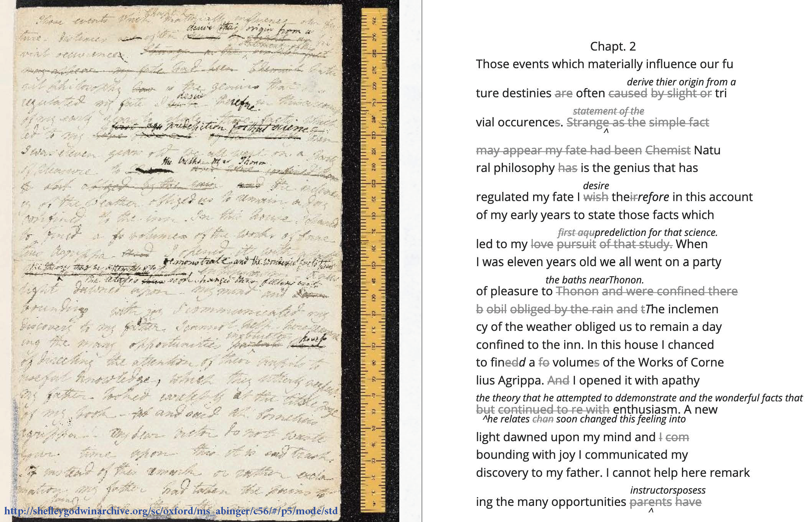
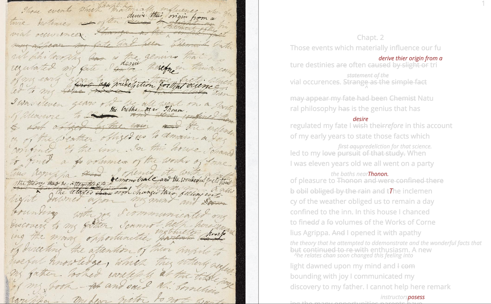
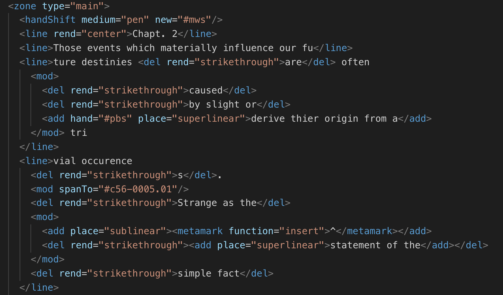

[<<<Previous  ](what_is_xml.md) | [Next>>>](basic_architecture.md)

# Modules and Modeling

Before we take a look at the basic architecture of a TEI document, we need to understand how the specific elements for that document are chosen and work together to present what we might approach as a model of the source text. I say *model* because each act of encoding implies a certain reading, or way of interpreting the elements, of the source text. So how do we choose what to encode? What are the key features that we want to represent? And what are the options available with TEI?

## Modules

The answer to these questions has to do with modules. Modules are specific subsets of TEI guidelines which apply to the type of encoding being done. For example, if you are encoding a manuscript or primary source, you will be using a different module from the one you would use to encode a poem. 

Modules are developed and maintained by a group in the Text Encoding Initiative, called the [Consortium](https://tei-c.org/). This group publishes the full guidelines on their website, specifying encoding methods for texts in humanities, social sciences and linguistics. 

The guidelines are organized into 23 modules. Each module describes a specific type of text encoding, based on the type of document you want to encode. There are also explanatory modules that describe the basic architecture and function of TEI, as well as how to implement the guidelines. All together, the guidelines address everything from representing verse, to dictionaries, to graphs and networks. The full list of modules consist of the following: 

    1 The TEI Infrastructure
    2 The TEI Header
    3 Elements Available in All TEI Documents
    4 Default Text Structure
    5 Characters, Glyphs, and Writing Modes
    6 Verse
    7 Performance Texts
    8 Transcriptions of Speech
    9 Dictionaries
    10 Manuscript Description
    11 Representation of Primary Sources
    12 Critical Apparatus
    13 Names, Dates, People, and Places
    14 Tables, Formulæ, Graphics and Notated Music
    15 Language Corpora
    16 Linking, Segmentation, and Alignment
    17 Simple Analytic Mechanisms
    18 Feature Structures
    19 Graphs, Networks, and Trees
    20 Non-hierarchical Structures
    21 Certainty, Precision, and Responsibility
    22 Documentation Elements
    23 Using the TEI

As you can see, the guidelines are *extensive* and present a steep learning curve for anyone who wants to fully understand the TEI framework. 

## Primary Source Module

Thankfully, you don't have to know all of the guidelines to use TEI. For this workshop, specifically, we will be working with a subset of the guidelines, **[The Represenation of Primary Sources](https://www.tei-c.org/release/doc/tei-p5-doc/en/html/PH.html)**, listed under Module 11. 

Even within this module, things can quickly get complicated. As anyone familiar with textual scholarship or editing knows, there are many approaches to the editing of texts. A diplomatic transcription, for example, which attempts to render visual elements of manuscripts as they appear on the page, differs greatly from a critical edition, which exercises editorial intervention to create an authoritative or definitive text. Without going too much into editorial theory, suffice it to say that this module is robust enough to be used toward both kinds of projects. 

Our focus, within the Primary Source module, is on *the diplomatic transcription of manuscripts*. This means that we will use a relatively small subset of tags that work to identify and render manuscript elements. For an example of this kind of encoding, refer to the below image from the [Shelley-Godwin Archive](http://shelleygodwinarchive.org/), which collects and displays the manuscripts of Percy Shelley, Mary Shelley, William Godwin, and Mary Wollstonecraft. 

This image shows the work of TEI in all its glory. On the left side, there is an image of the manuscript page (here, the first page of the manuscript for Mary Shelley's novel, *Frankenstein*). On the right side, there is the *diplomatic transcription*, which renders the textual elements on the page in readable form. You can see the strikethroughs and the additions on this transcription and you may have an easier time decyphering what is written here than on the manuscript. 

Pretty cool right? But this isn't all that TEI can do for manuscripts. Thanks to the tagging structure, which tags *not only* how elements might appear but also information about their *content*, we can also get a sense of whose writing appears in this manuscript. 

Some background information on this manuscript will be useful. As Mary Shelley wrote this story, her husband, Percy Shelley, revised it, adding his own deletions and additions in the interlinear spaces. With the TEI, the editor can tag the areas where Mary Shelley was drafting her story,and the areas where Percy Shelley intervened with his revisions. Below you will see Percy Shelley's emendations emphasized in red: 

Due to the tagging schema, the editors are able to indicate the sections of the manuscript where Percy often overwrites Mary. 

## Elements

Let's take a closer look at how they might have done this with TEI. The sections that are crossed out are marked as "deleted" with the **&lt;del>** tag. This is the shorted "del", enclosed within angle brackets, **&lt;** and **>**. 

The shortened word and its angle brackets form the anatomy of what we call an *element* in TEI. Elements create the tags that enclose the deleted text, with the second tag including a backslash **/** to indicate it's a closing tag. The full element, complete with the text it defines, is encoded like the following:

    <del>This is deleted text</del>

The actual deleted text goes insie of the **&lt;del>** tags. And you must always include both an opening and closing tag, or the computer won't know the bounds of the deleted text, and it will display as an error. 

In addition to elements, TEI also contains *attributes* that further describe certain elements. These qualify the element in some way, such as specifying how it should be rendered, using the *rend* attribute, for example. 

The attribute is always accompanied by a value that defines that attribute. If you want your deleted text to appear with a strikethrough, you would encode it the following way:

    <del rend="strikethrough">This is striked out text</del>

Notice a couple of things--first, the attribute followed by an equal sign, and its value is enclosed by quotation marks. This is standard form for defining the values of an attribute.

Let's see what some of this stuff looks like on the *Frankenstein* manuscript. Below, you can see an image of their code. 

Though this might seem a little overwhelming at first, don't worry! Much of it isn't relevant to our purposes, and I will talk you through the rest. 

The important thing to notice, at this point, is the *nested* structure of the code, where each **&lt;line>** contains **&lt;del>** or **&lt;add>** elements, which indicate where text has been deleted or added. You can also see some attributes such as **rend="strikethrough"**, which instruct how to render that piece of text. 

## Technical → Theoretical

It is important to recognize how the specific elements within each module reinforce a certain approach toward textual editing. Marking up a text is a *modeling activity*, in that it instantiates a certain interpretation of the textual data. In this way, the technical practice leads to a theoretical intervention. 

As the Women Writers Project explains, 

> The most significant concepts of text encoding, from a scholarly standpoint, are not the technical details but rather the broader ideas about modelling textual information, representational strategies, and editorial method: in fact, the same domain that has been the province of scholarly editing for centuries. What needs to be grasped is how these ideas translate into the digital medium, and what changes when they do. ("What Is TEI?")

Markup reveals what the encoder thinks are the necessary or hidden aspects of the text. It is, therefore, an interpretation. By modeling the text, one expresses their editorial approach, imposing their own reading of the text. In this way, TEI can be a tool for scholarship.

We will be looking more closely at the Primary Source module for our hands-on practice, where you will be encoding a manuscript. To prepare for that encoding activity, we now turn to the basic architecture of a TEI document. 

[<<<Previous  ](what_is_xml.md) | [Next>>>](basic_architecture.md)